**Dynamic Mode Decomposition (DMD) for Foreground 
Detection in Video - MATLAB**
========================================

by J. Barhydt1

*University of Washington, Seattle, WA, 98195*

> **Overview:**

> **Dynamic Mode Decomposition (DMD) has arisen as an incredibly value
> tool in decomposing nonlinear systems in order to model underlying
> dynamics. DMD offers a different set of modes than other dimensional
> reduction methods, such as singular value decomposition (SVD) and
> principal component analysis (PCA) in that DMD offers oscillatory time
> resolution of the underlying modes, such that each mode contains both
> spatial and temporal information. Oscillatory behavior shows up in
> many physical systems, giving DMD analysis a greater ability to
> 'capture' these dynamics. In this paper, DMD is used to separate
> foreground from background in a video stream, under the assumption
> that a background has more fixed time-dynamics than a moving and
> changing foreground.**

1- This report uses Extended Yale Faces B Database: http://vision.ucsd.edu/~iskwak/ExtYaleDatabase/ExtYaleB.html

- [Sec.   I. \| Introduction and Overview](#introduction-and-overview)
- [Sec.  II. \| Theoretical Background](#theoretical-background)
- [Sec. III. \| Algorithm Implementation and Development](#algorithm-implementation-and-development)
- [Sec.  IV. \| Computational Results](#computational-results)
- [Sec.   V. \| Summary and Conclusion](#summary-and-conclusions)
- [APPENDIX A\| MATLAB Functions Used](#appendix-a)
- [APPENDIX B\| MATLAB Code](#appendix-b)

# Introduction and Overview
==================================

Foreground detection is a task that humans \--and many animals\-- can do
quite naturally. Anyone who has seen the movie *Jurassic Park* can
attest to the T-Rex's weak ability to detect foreground. In a sense, the
DMD method will function quite similarly. By decomposing the video into
basis spatio-temporal modes, the DMD method allows one to 'pick out'
modes with the lowest oscillations frequency, which constitutes the
low-rank 'background'. In a video with a static background, this mode
hardly changes at all, although if the background changes over time, the
DMD allows a way to 'update' the background over time. This could be
valuable in foreground-background separation in shaky footage, or
surveillance video streams, where the background experiences changes
caused by weather, parked cars, loss of daylight, etc.

In this paper, two video streams, representing 'easy' and 'hard'
background detection are used. The easy video includes passersby on a
street outside of a cafe, where the camera was steadily rested on a
table, whereas the hard background video was taken by hand and features
several dogs running around a park. The foreground detection ability was
compared between simple SVD and DMD analysis. Ultimately, the methods
used in this paper will not surpass the ability of the T-Rex since DMD,
too relies on motion to separate the background and foreground.

# Theoretical Background
==================================

The DMD procedure broadly operates on the following mechanism: given
that some collected data is organized into frames in time, each
measurement can be organized into a column an acted upon by an operator
**A**, known as the Koopman operator, which takes the vectorized data
from one point in time (x~i~) to the next (x~i+1~) following Equation 1.
If the system were perfectly linear, this operator would remain constant
in time. If the dynamics are nonlinear, however, this operator will
change in time as well. Fortunately, for our case we are making the
assumption that **A** is reasonably constant over the duration of the
video. This works out mostly because the pixel space (32k pixels per
frame) is much smaller than the time space (3-400 frames). If the
dynamics required it, **A** could easily be 'chopped up' into shorter,
more linear periods of time.

>  (1)

In this paper's approach, rather than finding **A** directly,
dimensionality reduction allows to take only the most dominant
(low-rank) modes of the system, and capture their time dynamics, for
background subtraction. Therefore, we look for a representation of

(which contains all of the 
 columns stacked
side-by-side) in the basis of 
, from the SVD of 
 (which equivalently contains the 
 columns.) As such, the
time operator that was used is 
, which is defined as 
. Given the definition of the SVD (i.e. 
, 
 follows from Equations 2
through 5.

> 
>  (2)
>
> 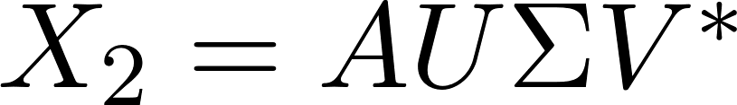 (3)
>
>  (4)
>
>  (5)

Ultimately then, we are left with an operator which, when acted upon by
a matrix 
 produces approximately the Koopman
operator A multiplied by that matrix, yielding an eigenvalue equation.
Thus, by taking the eigendecomposition of S, our DMD modes can be
constructed. It is important to remember that the above is merely a
linear approximation, however the eigendecomposition still holds. Since
A and S are related by a similarity transform (unitary rotation &
dilation), they share eigenvalues and eigenvectors. The DMD modes,

, are then given from the
projection of these eigenvectors, 
, onto the original SVD
basis, via 
. For considering the oscillatory nature
of the data, the eigenvalues, 
 are related to complex
exponentials, via Equation 6, which can be rewritten in terms of 
.

>  (6)

It is from these terms that the DMD time-dynamics are contained, and
thus determines how each mode is affected in time. Then, the dynamics of
the basis mode, U, is given by the sum over all basis states, or

> 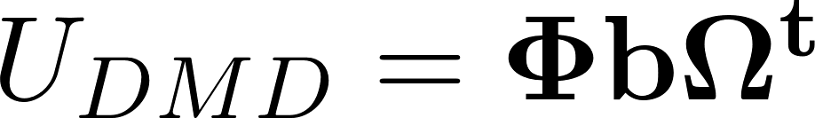 (7)

where 
 is a diagonal matrix of the 
 terms and 
 comes from the boundary
condition determined by 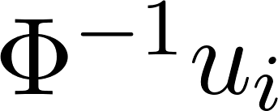
, where 
 is the first SVD basis
mode. Finally, the background separation comes from the fact that the
low rank modes (background) have small changes in time, and thus their

 terms are much smaller in magnitude. It
should also be noted that by 'pulling out' these low rank modes, the
remaining values are make up the sparse information in the video. Since
the sparse values are not part of the background detection, this
resulting remainder matrix will also absorb time dynamics which are not
resolved. Furthermore, only the absolute value of the low-rank DMD modes
are taken, to eliminate possible negative pixel values (which are not
allowed in pixel space). These values are also absorbed into that sparse
representation, thus preserving
.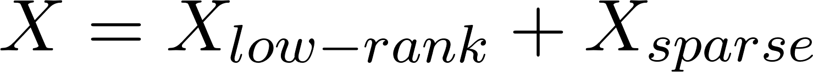

> 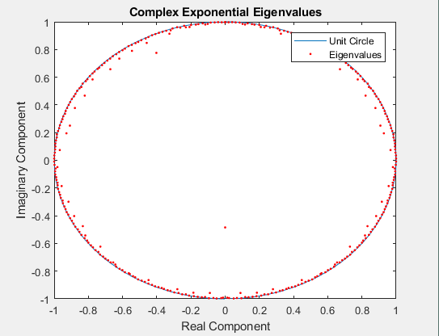

> **Figure 1. (left) Normalized Spectrum (log-scale) of Original Data SVD
> Modes. (right) Plot of Exponential Eigenvalues and Unit Circle in
> Complex Plane.**

> 

> **Figure 2. (left) Real and Imaginary Components of Time-Dynamics of the
> first Mode (left) and Minimum Oscillation Mode(right) showing Amplitude
> over the first 50 Frames.**

# Algorithm Implementation and Development
=====================================================

Once imported, the video is appropriately rescaled (to reduce
computation time) and colummated. This is the most time-consuming part
of the algorithm, and as such the matrix is saved so the video can be
rerun through different methods if needed. Ideally, the video stream
would come into the program already in the necessary format. Then, two
matrices are constructed from the original, representing the two data
matrices of Equation 2. Since the matrices are shifted, a single frame
is lost, and the number of frames is adjusted accordingly. SVD
decomposition, along with calculation of the components of S follow
exactly from Equation 5. Again, the time dynamics follow Equations 6 and
7 directly, where the timestep is set as 1 (since the space between each
frame is identical in time.) Thus 
 becomes the 'background' whose absolute
value is subtracted from each frame after normalization. The
normalization simply follows from subtracting the minimum value of the
background, BG, by the BG itself and then dividing by the range in BG.
Once the original frame is subtracted from the background, it is the
'foreground' which remains, and a filter is applied to extract a logical
matrix from the result, to be used as a filter. After the background
filters are returned, they can be utilized raw, or multiplied by the
video matrix to extract a foreground. Ultimately, the implementation of
the DMD method is very straightforward.

> 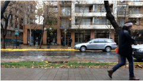

> 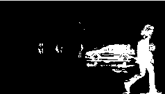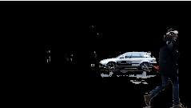

> **Figure 3. Results of DMD Foreground Detection on 'Easy' Video at Frame
> 39. **

> **(top left) Original Frame (top right) Low-Rank Background **

> **(bottom left) Foreground Detection (bottom right) Foreground Filtered
> From Original**

> 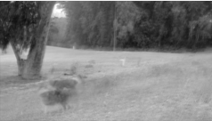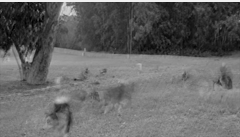

> **Figure 4. DMD Background Comparison Between First (left) and Last
> (right) Frames of 'Hard' Video.**

# Computational Results
=================================

To set the stage for the decomposition, the SVD spectrum of the data
matrix is shown on the left in Figure 1. It can be seen that the
majority of the structure is contained in a very low-rank space. In the
spectrum above, the first mode contained 38% of the magnitude of all
modes, and thusly has much of the spatial information enclosed.
Furthermore, the oscillatory eigenvalues are plotted on the right of
Figure 1, showing that most modes are neither damping or growing, since
their absolute values are less than 1. To compare oscillation rate of
various modes, 
 is shown for both the first mode 
 and the measured minimum 
 over the first 50 frames
of the 'hard' video. These low frequency modes dominate the 'background
space' since they change little over time.

For the 'easy' video, the background changed very little, and the
results of DMD separation and filtering are shown in Figure 3. Frame 39
was chosen since there was a lot of movement at that time (car driving
by, pedestrians up close and far away, etc.) The 'hard' video required a
bit more comparison, since the background was much more dynamic. Figure
4 demonstrates the subtle changes in the DMD background between the
first and last frames of the 'hard' video. The evolution of the
background frame, from which the foreground/background separation is
made, shows the ability of the DMD method to effectively track
background changes and 'flow' with them. Figure 5 represents the same
results as Figure 3, but rather analyzing the 'hard' video. Frame 275
was chosen for comparison following the same logic as before.

> 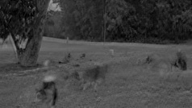

> 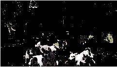

> **Figure 5. Results of DMD Foreground Detection on 'Hard' Video at Frame
> 39. **

> **(top left) Original Frame (top right) Low-Rank Background **

> **(bottom left) Foreground Detection (bottom right) Foreground Filtered
> From Original**

> 

> **Figure 5. Comparison Between DMD Background (left) and SVD Background
> (right)**

Finally, comparing the DMD foreground detection with SVD (with its
static low-rank approximation) is shown in Figure 6, where it can be
clearly how much the background has changed, given that the SVD method
essentially determines everything as being part of the 'foreground'
since the entire frame has changed, from the shaky nature of the
original footage.

# Summary and Conclusions
==================================

For video processing needs, the DMD method allows for much more robust
background separation than static methods like SVD, given by its ability
to include time-resolved oscillatory behavior to 'update' the background
as time progresses. This method could be viable for foreground detection
in video streams that have non-ideal (i.e. shaky) background motion, and
could even provide for a method of creating a 'green-screen' from raw
video, although in practice a user may want to use something like a
gaussian filter to 'smooth out' the foreground filter. Without any
knowledge of the underlying mechanics driving the oscillations, the DMD
method allows for equation-free dimensionality reduction, which can be
useful in many fields considering nonlinear behavior.

# APPENDIX A 
(MATLAB Functions Used / Description With Example)
=============================================================

**1)**

function \[vid\_filter\] = mat2fg(X)

\%This function accepts a matrix of colummated video snapshots and
returns a

\%logical filter, separating foreground from background elements, using
low

\%rank DMD modes. video filter will be similarly colummated, thus
reshaping

\%would be necessary if original video is to be played.

\% construct X\_1\^{M-1} and X\_2\^{M}, drop a frame

X1=X(:,1:end-1); X2=X(:,2:end);

n\_frames=size(X1,2);

\% SVD of X\_1\^{M-1} to construct S

\[u,s,v\]=svd(X1,\'econ\');

S=u\'\*X2\*v\*diag(1./diag(s));

\% eigen decomp S for DMD

\[y,S\_eigs\]=eig(S);

lambda=diag(S\_eigs);

\% form of e\^wt

dt=1;

w=log(lambda)/(dt);

\[\~,w0\]=min(w);

phi=u\*y;

\% boundary cond slowest oscillation.

phi\_0=phi\\u(:,1);

\% basis modes \--\> phi(x,t)= sum( phi(0)\*e\^wt

b\_e\_wt=phi\_0.\*exp(w\*(1:n\_frames));

u\_dmd=phi\*b\_e\_wt;

\% spectra of X1

\% figure(1)

\% title(\'Normalized Spectrum of X1 SVD Modes\')

\% xlabel(\'SVD Mode\')

\% ylabel(\'Relative Mode Strength\')

\% semilogy(diag(s)/sum(diag(s)))

\% spectra of S around complex unit circle

\% figure(2)

\%
plot(cos(0:pi/50:2\*pi),sin(0:pi/50:2\*pi),imag(lambda),real(lambda),\'r.\')

\% title(\'Complex Exponential Eigenvalues\')

\% xlabel(\'Real Component\')

\% ylabel(\'Imaginary Component\')

\% legend(\'Unit Circle\',\'Eigenvalues\')

\% 1st oscillation mode, first 50 frames

\% figure(3)

\% plot(real(b\_e\_wt(1,1:50))), hold on

\% plot(imag(b\_e\_wt(1,1:50)),\'\--\')

\% title(\'Oscillation of \\omega\_1 in Time\')

\% xlabel(\'Time (frame\#)\')

\% ylabel(\'Amplitude\')

\% legend(\'Mode Evolution (real)\',\'Mode Evolution (imaginary)\')

\% subtract vid from bg

\% normalize BG, range from 0 to 1

BG = abs(u\_dmd);

init\_range = double(\[min(BG(:)) max(BG(:))\]);

inv\_range = 1/(init\_range(2)-init\_range(1));

BG = imlincomb(inv\_range, BG, -init\_range(1)\*inv\_range, \'double\');

\% low-rank bg and original

XS=( BG-X1 );

\% make fg video filter, value could be tuned, but 1/4 works on all test

vid\_filter=abs(XS)\>0.25;

end

# APPENDIX B 
(MATLAB Code)
========================

\% Background/Foreground Separation via Dynamic Mode Decomposition
(DMD)\
% Johnathon R Barhydt\
%\
% This code takes a video and uses the DMD modes with the smallest\
% time-variance to determine background, from which a foreground
detection\
% filter is made and masked with the original video.\
%\
% specs for this run:\
% two videos from cell phone, about 10 seconds long. first video is
looking\
% out the window of a coffee shop, the camera is still. second video is\
% held by hand, and shows dogs running around a dog park. background is\
% more shaky in the video.\
%\
clear all; close all; clc\
% video name\
vid\_name=\'DCIM\_0001.mp4\';\
% rescale video\
a=1/8;\
% import video\
v = VideoReader(vid\_name);\
n\_frames = 1;\
while hasFrame(v)\
vid = readFrame(v);\
video(:,:,:,n\_frames) = imresize(vid, \[a\*v.Height a\*v.Width\]);\
n\_frames = n\_frames+1;\
end\
% video dimensions\
im\_h=size(video,1);\
im\_w=size(video,2);\
% remove fencepost frame\
n\_frames=n\_frames-1;\
% save video as matrix\
save(\'video.mat\',\'video\');\
\
%%\
% import saved video (redundant if already performed above)\
vid\_mat=\'video.mat\';\
% get camera data\
video = importdata(vid\_mat);\
%%\
% create colummated data matrix, one snapshot per column\
for i=1:size(video,4)\
image = im2double( imresize( rgb2gray(video(:,:,:,i)) ,\[im\_h im\_w\] )
);\
X(:,i)= reshape(image,\[im\_h\*im\_w,1\]);\
end\
\
% send data matrix to my DMD function\
vid\_filter = mat2fg(X);\
%% show fg video filter\
for i=1:n\_frames\
frame=reshape( vid\_filter(:,i), \[im\_h im\_w\]);\
imshow(mat2gray(frame)); drawnow\
end\
%% show fg filtered video\
% triplicate filter for r,g,b channels\
A=cat(3,vid\_filter,vid\_filter,vid\_filter);\
A=permute(A,\[1 3 2\]);\
A=reshape( A,\[im\_h im\_w 3 n\_frames\]);\
\
% filtered video, with BG removed!\
f\_vid = double(video(:,:,:,1:end-1)).\*double(A);\
\
for i=1:n\_frames\
imshow(uint8(f\_vid(:,:,:,i))); drawnow\
end\
\
%% For FUN! this plots ALL oscillation modes and their evolution in
space\
% figure(1)\
% set(gcf, \'Position\', get(0, \'Screensize\'));\
% set(gca,\'Ylim\',\[-.00001 .00001\],\'Xlim\',\[-.00001
.00001\],\'Color\',\'k\')\
% for i=1:449\
% plot(b\_e\_wt(i,:),\'w.-\')\
% %plot(exp(w(i)\*i),\'ko\')\
% set(gca,\'Ylim\',\[-.00001 .00001\],\'Xlim\',\[-.00001
.00001\],\'Color\',\'k\')\
% pause(0.08)\
% drawnow\
% end
